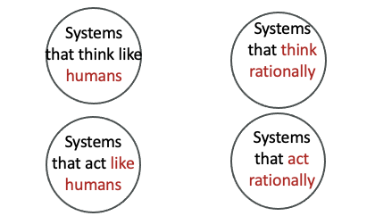
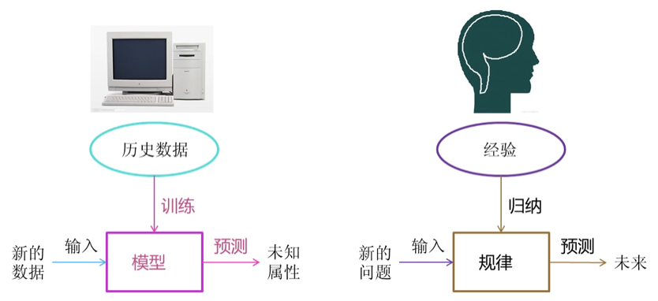
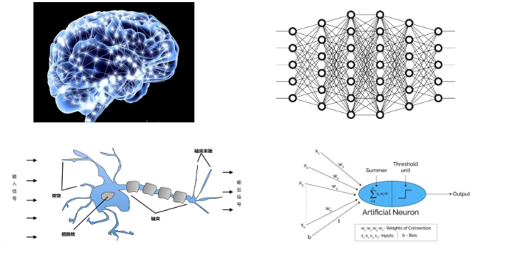
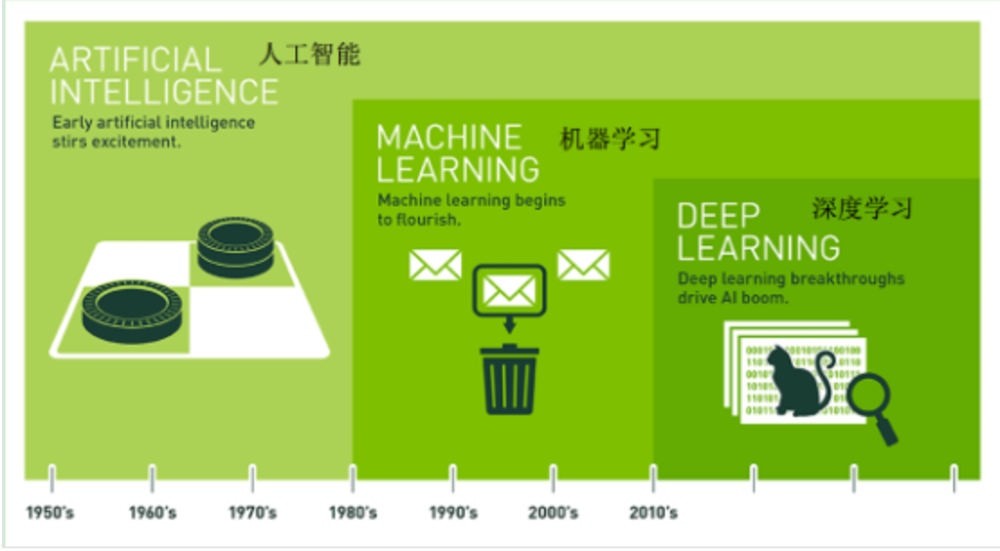
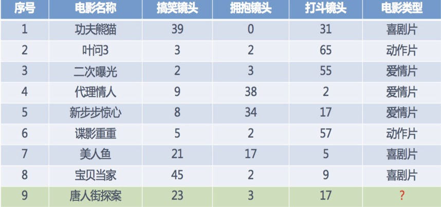
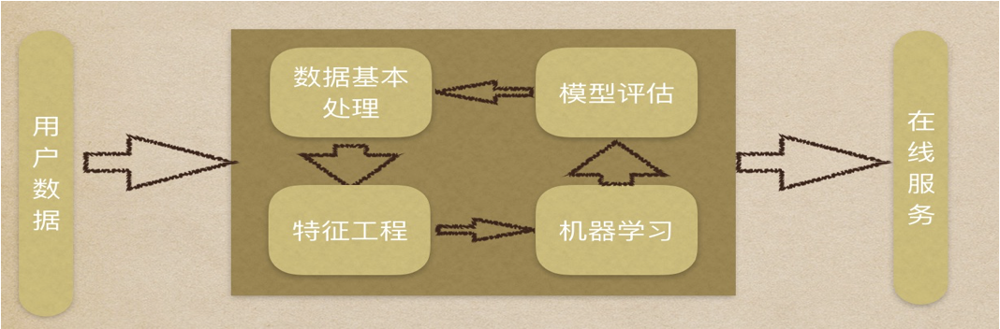
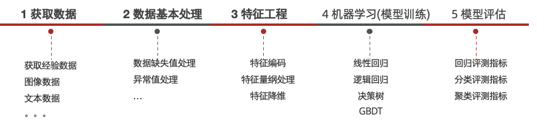
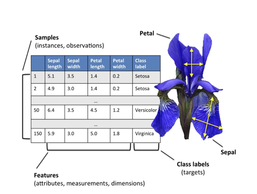
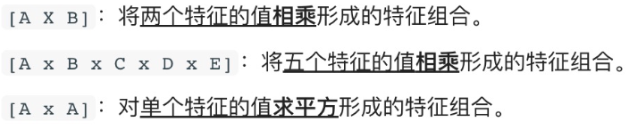

# 机器学习概述
## 人工智能三大概念

### 人工智能

- Artificial Intelligence  人工智能

- 释义 - 仿智； 像人一样机器智能的综合与分析；机器模拟代替人类

### 机器学习

- Machine Learning   释义：机器学习

- 释义：让机器自动学习，而不是基于规则的编程（不依赖特定规则编程）

### 深度学习

深度学习(DL, Deep Learning) : ，也叫深度神经网络，大脑仿生，设计一层一层的神经元模拟万事万物

### 三者之间的关系

机器学习是实现人工智能的一种途径

深度学习是机器学习的一种方法

## 机器学习的主要研究内容

机器学习所研究的主要内容，是关于在计算机上从数据中产生 “模型”（model）的算法，即 “学习算法”（learning algorithm）。
把经验数据提供给学习算法，就可以基于这些数据产生模型；
这样在面对新情况的时候（例如预测股票价格，房价等），模型就可以给我们提供相应的判断。

## 样本，特征，标签/目标值

### 一、样本（Sample）

**定义：**
一个样本就是一条数据记录，也可以理解为“一个观察对象”。

#### 例1：房价预测

| 房屋编号 | 面积  | 房间数 | 房价   |
| ---- | --- | --- | ---- |
| 1    | 80㎡ | 2   | 200万 |

这一整行就是一个样本

#### 例2：垃圾邮件分类

* 一个样本 = 一封邮件

每封邮件就是一个独立样本

---

### 二、特征（Feature）

**定义：**
特征是用来描述样本的属性或信息，通常是输入变量。

#### 例1：房价预测

| 特征  |
| --- |
| 面积  |
| 房间数 |
| 地段  |

这些都是特征

#### 例2：垃圾邮件分类

| 特征       |
| -------- |
| 是否包含“免费” |
| 是否包含链接   |
| 邮件长度     |

这些就是用来判断是不是垃圾邮件的依据

---

### 三、标签 / 目标值（Label / Target）

**定义：**
标签是我们希望模型预测的结果。

#### 例1：房价预测（回归问题）

* 标签 = 房价（连续值）

#### 例2：垃圾邮件分类（分类问题）

* 标签 = 是否垃圾邮件（0 / 1）

## 算法分类

### 有监督学习

- 定义：输入数据是由输入特征值和目标值所组成，即输入的训练数据有标签的

- 数据集：需要人工标注数据

#### 分类和回归
1. 分类
   - 目标值（标签值）是不连续的，如垃圾邮件分类
   - 分类种类：二分类、多分类任务
2. 回归 
   - 目标值（标签值）是连续的，如房价预测

### 无监督学习

- 定义：输入数据没有被标记，即样本数据类别未知，**没有标签**，根据样本间的相似性，对样本集聚类，以发现事物内部 结构及相互关系。

- 数据集：不需要标注数据

**无监督学习特点：**

1. 训练数据无标签 
2. 根据样本间的相似性对样本集进行聚类，发现事物内部结构及相互关系

#### 案例一、 用户分群（最经典例子）
- 场景：
一个电商平台有很多用户，但没有用户标签（比如“高价值用户”“潜在用户”等）。

- 数据： 每个用户有一些行为数据（ 浏览次数 购买金额 活跃时间 点击偏好）

无监督学习做什么？
- 用聚类算法（比如 K-Means）自动把用户分成几类：

可能产生的结果：

- 类别一：高消费、高活跃（核心用户）
- 类别二：只浏览不买（潜在用户）
- 类别三：低频低消费（边缘用户）

> 这些类别不是人为给的，而是算法“自己发现的”

### 半监督学习
工作原理：

1. 让专家标注少量数据，利用已经标记的数据（也就是带有类标签）训练出一个模型 
2. 再利用该模型去套用未标记的数据 
3. 通过询问领域专家分类结果与模型分类结果做对比，从而对模型做进一步改善和提高

#### 案例二、 医疗数据
- 场景：提高肺结节检测准确率，同时降低医生标注成本
- 具体目标： 尽量少漏诊（高召回）控制误报（合理精度）减少医生标注时间（降成本）
- 数据： *10万张*未标注的CT影像 和*500张*已标注的的CT影像  

##### 训练过程

1. 训练初始模型（用“真标签”）

   用 500 张医生标注数据训练模型 ，模型学会基础能力：什么像结节 什么不像 。但此时模型容易过拟合、泛化能力弱

2. 给无标签数据打“伪标签”

   用模型去预测 10万张 CT

3. 筛选“高置信数据”

   - 只保留： 置信度 > 95% 的预测结果
   - 得到： 2万张“高可信伪标签数据” 
   - 丢弃： 模糊、不确定的数据（避免污染）

4. 构造“增强训练集”

   训练数据变成：
   
   - 500 张（医生标注）✅ 高质量
   - 2万张（模型伪标）⚠️ 次高质量

5. 重新训练模型
   
   用新数据重新训练

6. 迭代优化

   重复步骤 2–5

## 机器学习的建模流程

---

### 特征工程

从数据集角度来看：一列一列的数据为特征。

从模型训练角度来看： 对预测结果有用的属性为特征

特征工程是：利用专业背景知识和技巧处理数据，让机器学习算法效果最好。这个过程就是特征工程

>  Coming up with features is difficult, time-consuming, requires expert knowledge. “Applied machine learning” is basically feature engineering. ”
> 释义：特征工程是困难、耗时、需要专业知识。应用机器学习基础就是特征工程                             

> 数据和特征决定了机器学习的上限，而模型和算法只是逼近这个上限而已。

#### 特征提取

从原始数据中提取与任务相关的特征，构成特征向量

对于文本、图片这种非行列形式的数据行列形式转换， 一旦转换成行列形式一列就是特征

#### 特征预处理

特征对模型产生影响；因量纲问题，有些特征对模型影响大、有些影响小

比如：

- 不同特征量纲不一样（身高 cm vs 收入 元）
- 数据分布很偏（收入大多集中在低值）
- 有缺失值
- 类别数据无法直接计算（比如“男/女”）
- 数值范围差异巨大（0~1 vs 0~1,000,000）

##### 常见特征预处理方法

1. 标准化（Standardization）

   把数据变成：
   
   $$ x' = \frac{x - \mu}{\sigma} $$
   
   * 均值 = 0 方差 = 1
   
   例如 ：
   
   | 身高  | 标准化后 |
   |-----|------|
   | 170 | -0.2 |
   | 180 | 1.1  |

2. 归一化（Normalization）

   把数据缩放到固定范围，比如 [0,1]
   
   $$
   x' = \frac{x - x_{min}}{x_{max} - x_{min}}
   $$
   
   例如：
   
   | 分数  | 归一化 |
   |-----|-----|
   | 60  | 0.0 |
   | 100 | 1.0 |

### 特征降维

将原始数据的维度降低，叫做特征降维，但这样会丢失部分信息。

降维就需要保证数据的主要信息要保留下来，原始数据会发生变化，不需要了解数据本身是什么含义，它保留了最主要的信息。

例如：

   假设我们有一个学生数据集：

| 学生 | 数学 | 物理 | 化学 | 英语 |
|----|----|----|----|----|
| A  | 90 | 88 | 92 | 85 |
| B  | 60 | 65 | 58 | 70 |
| C  | 80 | 82 | 79 | 78 |

   我们把 (数学, 物理, 化学, 英语) → (理科能力, 英语能力)。数据维度从 **4维 → 2维**

| 学生 | 理科能力 | 英语能力 |
|----|------|------|
| A  | 0.90 | 0.85 |
| B  | 0.61 | 0.70 |
| C  | 0.80 | 0.78 |

### 特征组合

把多个的特征合并成一个特征。

## 模型拟合问题

- 拟合：用来表示模型对样本点的拟合情况

- 欠拟合：模型在训练集上表现很差、在测试集表现也很差

   >  原因：模型过于简单

- 过拟合：模型在训练集上表现很好、在测试集表现很差

   > 原因：模型太过于复杂、数据不纯、训练数据太少

- 泛化：模型在新数据集（非训练数据）上的表现好坏的能力

   > 奥卡姆剃刀原则：给定两个具有相同泛化误差的模型，较简单的模型比较复杂的模型更可取

## 其他概念

### 假设空间

假设空间是所有“可能的模型/规则”的集合。

你在做机器学习，本质是在找一个函数：
$$h:X→Y$$

比如：
- 输入：房子面积 → 输出：价格
- 输入：邮件内容 → 输出：垃圾/正常

那“假设空间”就是：你允许自己考虑的所有可能函数的集合。

### 版本空间

在假设空间中，所有与当前训练数据完全一致的假设集合，是假设空间的子集。

### 归纳偏好

当多个模型都符合数据时，学习算法“偏好选择哪一个“

### NFL定理（No Free Lunch Theorem）

对于一个学习算法 $L_a$,若它在某些问题上比学习算法$L_b$好，则必然存在另一些问题，在那里 $L_b$要比 $L_a$要好。