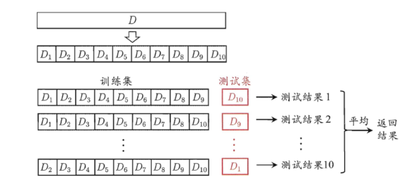
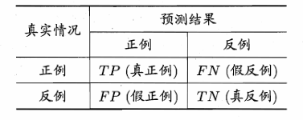

# 模型评估与选择

## 1. 误差

- 错误率(Error rate): 分类错误的样本数占样本总数的⽐例 ,记为 $E = a / m$ (a为分类错误的样本数,m为样本总数)
- 精度(Accuracy): 1 - 错误率, 记为 $Acc = 1 - a / m$
- 误差(Error): 模型预测输出与真实数据输出之间的差异。
- 训练误差/经验误差(training error/ empirical error):模型在训练集上的误差
- 泛化误差(generalization error)：模型在测试集上的误差
> 评判一个模型好不好,不能只看经验误差(训练误差),更要看泛化误差。

在很多情况下,我们可以学得⼀个经验误差很⼩、在训练集上表现很好的学习器,例如甚⾄对所有训练
样本都分类正确,即分类错误率为零,分类精度为100%,但这是不是我们想要的学习器呢？
遗憾的是,这样的学习器在多数情况下都不好.

## 2. 拟合与过拟合
我们希望得到一个对所有潜在样本都尽可能好的模型。
为了达到这个⽬的,应该从训练样本中尽可能学出适⽤于所有潜在样本的“普遍规律”。这样才能在遇到新样本时做出正确的判别.
然⽽,当学习器把训练样本学得“太好”了的时候,很可能已经把训练样本⾃⾝的⼀些特点当作了所有潜在样本都会具有的⼀般性质,这样就会导致泛化性能下降,这种现象在机器学习中称为 “过拟合”(overfitting).
与“过拟合”相对的是“⽋拟合”(underfitting),这是指对训练样本的⼀般性质尚未学好.

>有多种因素可能导致过拟合,其中最常见的情况是由于学习能⼒过于强⼤,
> 以⾄于把训练样本所包含的不太⼀般的特性都学到了,⽽⽋拟合则通常是由于学习能⼒低下⽽造成的.
> ⽋拟合⽐较容易克服,例如在决策树学习中扩展分⽀、在神经⽹络学习中增加训练轮数等,⽽过拟合则很⿇烦.在后⾯的学习中
> 我们将看到,过拟合是机器学习⾯临的关键障碍,各类学习算法都必然带有⼀些针对过拟合的措施；
> 然⽽必须认识到,过拟合是⽆法彻底避免的,我们所能做的只是“缓解”,或者说减⼩其风险.
> 关于这⼀点,可⼤致这样理解：机器学习⾯临的问题通常是NP难甚⾄更难,⽽有效的学习算法必然是在多项式时间内运⾏完成。
> 若可彻底避免过拟合,则通过经验误差最⼩化就能获最优解,这就意味着我们构造性地证明了“P=NP”；因此,只要相信“P != NP”,过拟合就不可避兔.

## 3. 数据集的划分
对一个包含$m$个样例的数据集$D = \{(x_i,y_i) \quad ,(i = 1,2,\cdots,m)\}$,将其划分为训练集$S$和测试集$T$,常见的划分方法如下。

### 3.1 留出法(hold-out)
直接将数据集D划分为两个互斥的集合,其中⼀个集合作为训练集S,另⼀个作为测试集T,一般比例在 3:7 / 2:8.

### 3.2 交叉验证法(cross-validation)
将数据集$D$划分为k个⼤⼩相似的互斥⼦集,即$D=D_1UD_2...UD_k$；
每个⼦集$D_i$都尽可能保持数据分布的⼀致性,即从D中通过分层采样得到,
然后,每次⽤$k-1$个⼦集的并集作为训练集,余下的那个⼦集作为测试集；
这样就可获得$K$组训练/测试集,从⽽可进⾏$k$次训练和测试,最终返回的是这k个测试结果的均值.
显然,交叉验证法评估结果的稳定性和保真性在很⼤程度上取决于的取值,为强调这⼀点,通常把交又验证法称头“k折交叉验证”(k-fold-cross validation)

## 4. 性能度量指标

在机器学习中,模型训练完成后,需要通过一定的指标衡量模型的预测性能。不同类型的机器学习任务,其评价方式也有所不同。对于回归任务,预测结果通常是连续数值,因此主要关注预测值与真实值之间的偏差；对于分类任务,预测结果是离散类别,因此通常需要关注分类正确与错误的情况,以及不同错误类型所带来的影响。

---

### 4.1 回归任务的度量指标

回归任务的目标是预测一个连续变量。例如,根据房屋面积、位置等特征预测房屋价格,或者根据设备运行参数预测设备的温度、压力等。

设测试集包含$n$个样本,第$i$个样本的真实值为$y_i$,模型预测值为$\hat{y}_i$。

#### 4.1.1 均方误差(Mean Squared Error,MSE)

均方误差是回归任务中最常用的评价指标之一,其定义为

$$
MSE=\frac{1}{n}\sum_{i=1}^{n}(y_i-\hat{y}_i)^2
$$

##### 均方误差的特点

对异常值比较敏感,如果测试集中存在少量异常样本,并且模型在这些样本上的预测误差非常大,那么平方操作会显著放大这些误差,从而使MSE受到较大影响。

---

### 4.1.2 平均绝对误差(Mean Absolute Error,MAE)

平均绝对误差的定义为

$$
MAE=\frac{1}{n}\sum_{i=1}^{n}|y_i-\hat{y}_i|
$$

与MSE相比,MAE并不对误差进行平方,而是直接计算误差的绝对值。

因此,MAE可以理解为：

> **模型平均每个样本预测错误了多少。**

##### 平均绝对误差的特点

鲁棒性更好,对异常值不敏感。

---

### 4.2 分类任务的度量指标

分类任务的目标是预测样本所属的类别。例如判断一封邮件是否为垃圾邮件、判断患者是否患病,或者判断工业设备是否发生故障。

对于二分类问题,假设真实类别只有正类(Positive)和负类(Negative),模型的预测结果可以分为以下四种情况：

* **TP(True Positive)**：真实为正类,预测也为正类。
* **TN(True Negative)**：真实为负类,预测也为负类。
* **FP(False Positive)**：真实为负类,但预测为正类。
* **FN(False Negative)**：真实为正类,但预测为负类。

这四种结果构成了分类任务中非常重要的**混淆矩阵(Confusion Matrix)**,如下图所示。

后续的错误率、精确率、召回率、F1 Score等指标,本质上都是在不同角度对这四种预测结果进行统计。
> 不同的分类阈值会导致产生不同的混淆矩阵,一般来说：**提高分类阈值,模型预测正类的偏好会降低,反映在数据上$(TP + FP)$就会减少,而(TN + FN)则会增大**
---

#### 4.2.1 错误率与精度

分类任务最直观的评价方式是计算模型预测正确和预测错误的样本比例。

**错误率(Error Rate)**定义为

$$
Error=\frac{FP+FN}{TP+TN+FP+FN}
$$

错误率表示：

> **所有样本中,有多少比例被模型错误分类。**

与错误率对应的是**精度(Accuracy)**：

$$
Accuracy=\frac{TP+TN}{TP+TN+FP+FN}
$$

因此二者满足

$$
Accuracy=1-Error
$$

---

#### 4.2.2 精确率、召回率和P-R曲线

##### 精确率(Precision)

精确率定义为

$$
Precision=\frac{TP}{TP+FP}
$$

> 精确率表示**“模型预测为正例的结果中预测正确的比例”**

例如,一个疾病检测模型预测100个人患病,其中80人确实患病,那么

$$
Precision=\frac{80}{100}=80\%
$$

精确率关注的是**模型预测出来的正类是否可靠**。
因此,如果一个模型非常关注减少误报,即希望尽可能避免把正常人判断为患者,那么就需要关注Precision。

---

##### 召回率(Recall)

召回率又称**真正率(True Positive Rate,TPR)**,定义为

$$
Recall=\frac{TP}{TP+FN}
$$

> 召回率表示**真实结果为正例的样本中,成功被预测出来的比例**

例如,实际有100个患者,模型成功识别出了90个,那么
$$
Recall=\frac{90}{100}=90%
$$
Recall关注的是模型**有没有漏掉真正的正类**。
因此,在疾病诊断、故障检测、欺诈检测等任务中,如果漏掉一个正类样本的代价很高,通常需要重点关注Recall。

##### Precision与Recall之间的权衡

Precision和Recall通常存在一定的权衡关系。

例如,在二分类模型中,模型可能输出一个样本属于正类的概率：

$$
P(Y=1|X=x)
$$

如果规定概率大于$0.5$才预测为正类,那么分类阈值就是$0.5$。

如果降低阈值,例如从$0.5$降低到$0.3$,模型会更加容易把样本判断为正类。这样通常会减少FN,提高Recall,但同时也可能增加FP,使Precision下降。

因此,可以通过不断改变分类阈值,得到不同的Precision和Recall组合,并绘制**P-R曲线(Precision-Recall Curve)**。

P-R曲线以Recall为横轴,以Precision为纵轴,描述不同分类阈值下二者之间的变化关系。

对于正类比例较低的类别不平衡问题,P-R曲线通常比单独使用Accuracy更加有意义,因为它能够直接反映模型对于正类样本的识别能力。

---

#### 4.2.3 F1 Score

Precision和Recall分别关注不同方面：

* Precision关注“**预测出来的正类有多少是真的**”；
* Recall关注“**真正的正类有多少被找出来了**”。

如果我们希望同时考虑Precision和Recall,可以使用F1 Score。

F1 Score是Precision和Recall的调和平均数：

$$
F1=\frac{2\times Precision\times Recall}{Precision+Recall}
$$

将Precision和Recall代入,可以得到

$$
F1=\frac{2TP}{2TP+FP+FN}
$$

F1 Score越高,说明模型在Precision和Recall之间取得了更好的平衡。

之所以使用调和平均数而不是普通算术平均数,是因为调和平均数对较小的数更加敏感。

例如：

$$
Precision=0.9,\quad Recall=0.1
$$

虽然算术平均数为$0.5$,但F1 Score只有

$$
F1=\frac{2\times0.9\times0.1}{0.9+0.1}=0.18
$$

这更加符合实际情况：一个模型即使Precision非常高,但Recall非常低,也不能认为它具有很好的综合分类能力。

因此,F1 Score特别适合用于**类别不平衡,并且同时重视Precision和Recall**的分类任务。

> $F_\beta \;\text{Score}$:是F1 Score的推广形式,通过参数 $\beta$ 控制 Precision 和 Recall 的相对重要程度：
$$
F_\beta =\frac{1}{1 + \beta^2}\cdot (\frac{1}{P} + \frac{\beta^2}{R}) = (1+\beta^2) \frac{Precision \times Recall} {(\beta^2 Precision) + Recall}
$$
其中,$\beta$ 越大,表示越重视 Recall；$\beta$ 越小,表示越重视 Precision。
当 $\beta=1$ 时,
> 
---

#### 4.2.4 ROC曲线和AUC值

ROC曲线(Receiver Operating Characteristic Curve)也是分类模型中非常常用的评价工具。

ROC曲线的横轴是**假正率(False Positive Rate,FPR)**：

$$
FPR=\frac{FP}{FP+TN}
$$
> 假正率表示“所有真正的负类样本中,有多少被模型错误地识别成了正类。”

纵轴是真正率(True Positive Rate,TPR),也就是召回率：

$$
TPR=\frac{TP}{TP+FN}
$$

因此,ROC曲线描述的是：

> **随着分类阈值不断变化,模型的真正率和假正率如何变化。**

当分类阈值较高时,模型只有在非常确信样本属于正类时才会预测为正类,因此通常具有较低的FPR和较低的TPR。

当逐渐降低阈值时,模型会将更多样本判断为正类,TPR和FPR通常都会提高。

将不同阈值下得到的$(FPR,TPR)$绘制在二维坐标系中,就可以得到ROC曲线。

##### AUC

AUC(Area Under the ROC Curve)表示ROC曲线下面的面积：

$$
AUC=\int_0^1 TPR(FPR),dFPR
$$

AUC的取值范围通常为$[0,1]$。

一般来说：

* $AUC=1$：模型具有完美的分类能力；
* $AUC=0.5$：模型与随机猜测的效果相当；
* $AUC>0.5$：模型具有一定的分类能力；
* $AUC<0.5$：模型的预测方向甚至比随机猜测更差,但如果将预测方向反转,其效果可能优于随机猜测。

AUC有一个非常重要的统计解释：

> **随机选取一个正样本和一个负样本,模型将正样本的预测得分排在负样本之前的概率。**

因此,AUC衡量的并不只是某一个固定分类阈值下的分类效果,而是模型对正负样本进行**排序和区分的整体能力**。

---

#### 4.2.5 代价敏感错误率与代价曲线

前面介绍的错误率默认认为不同类型的错误具有相同的代价。

但是,在实际应用中,**FP和FN往往具有完全不同的后果**。

例如,在疾病筛查中：

* FP：将健康的人误判为患者,可能导致额外检查；
* FN：将真正的患者误判为健康,可能导致患者无法及时治疗。

显然,这两种错误造成的实际损失可能并不相同。

因此,可以为不同类型的错误赋予不同的代价。

假设：

* FP的代价为$C_{FP}$；
* FN的代价为$C_{FN}$。

那么模型的总分类代价可以表示为

$$
Cost=C_{FP}\times FP+C_{FN}\times FN
$$

进一步考虑不同样本数量或样本权重后,还可以构造更加一般的**代价敏感错误率(Cost-sensitive Error Rate)**。

与普通错误率相比,代价敏感评价指标不再简单地认为“预测错一个样本就是一次相同的错误”,而是根据不同错误所造成的实际损失进行加权。

例如,如果

$$
C_{FN}=10C_{FP}
$$

那么一个FN的代价相当于十个FP。这时,即使模型产生了更多的FP,也可能仍然是一个更好的模型,因为它减少了代价更高的FN。

---

##### 代价曲线

当分类模型的阈值发生变化时,FP和FN的数量也会发生变化,因此模型对应的总成本也会发生变化。

将不同阈值或者不同条件下的模型成本绘制出来,就可以得到**代价曲线(Cost Curve)**。

代价曲线的核心思想是：

> **不再只问“模型预测对了多少”,而是进一步问“模型犯错之后需要付出多大的实际代价”。**

## 5. 超参数调节(Hyperparameter Tuning)
在机器学习模型中,除了通过训练数据学习模型参数之外,通常还存在一些无法直接通过训练过程学习得到,而需要人为设定的参数,这些参数称为超参数（Hyperparameter）。
超参数调节的目的就是寻找一组能够使模型在未知数据上具有较好泛化能力的超参数组合。下面介绍几种常用的超参数调节方法：

1. 网格搜索(Grid Search)
定义：网格搜索是一种穷举搜索方法,它通过在指定的参数值范围内,按照一定步长进行遍历,尝试所有可能的参数组合,从而找到最优的参数设置。
优点：全面、系统,能够找到全局最优解(在给定范围内)。
缺点：计算成本高,特别是在参数空间较大时,需要消耗大量时间和资源。

2. 随机搜索(Random Search)
定义：随机搜索是在参数空间中随机选择一组参数进行训练和评估,通过多次迭代来寻找较优的参数配置。
优点：相比网格搜索,随机搜索能够在相同的计算预算下探索更多的参数组合,尤其适用于高维参数空间。
缺点：可能无法找到全局最优解,但通常能找到一个较好的近似解。

3. 贝叶斯优化(Bayesian Optimization)
定义：贝叶斯优化利用贝叶斯统计理论,根据历史实验结果构建目标函数的概率模型(后验分布),然后基于该模型选择下一个最有潜力的实验点进行评估。
优点：高效,能够快速收敛到较好的参数配置；特别适用于代价高昂的函数优化问题。
缺点：依赖于初始点的选择和先验分布的假设,对于某些复杂问题可能需要较多的初始样本。