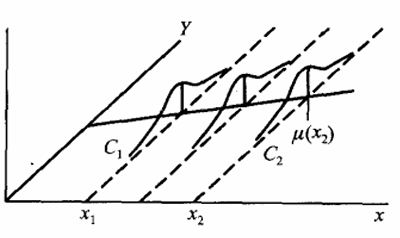

# 线性回归
## 1. 线性回归的相关概念

### 1.1 确定性关系和相关性关系

 **确定性关系**: 给定一个自变量就可以确定一个与之对应因变量的值,即$y = f(x)$
> 例如,给定时间$t$,我们就可以确定物体在自由落体中下落的高度 $h = \frac{1}{2}gt^2$

 **相关性关系**: 自变量和因变量直接的关系并不明确,而是表现为具有随机性的一种"趋势".即对自变量$X$的同一个值, 在不同的观测中,因变量$Y$可以取不同的值,但若$X$在一定范围之内,$Y$会随着$X$的变化而呈现出一定趋势的变化.粗略的来说,自变量和因变量存在如下关系:
    $$
    E(Y | X = x) = f(x)
    $$
 > 如:从统计意义来上说,身高和体重之间存在某种趋势关系,即身高越高体重也越重

### 1.2  回归 (regression)
回归是能为一个或多个自变量与因变量之间关系建模的一类方法。以单个变量为例,回归模型试图通过给定$X = x$,得到$Y$的“经验值”,即求条件期望 $E(Y | X = x)$,那么对任意给定的$x$,我们可以给出$Y$的预测值：
$$
Y = E[Y | X = x] + \epsilon
$$
其中,$\epsilon$是随机误差,通常我们认为误差由$Y$的非决定性因素所引起。如果存在多个(假定有k个)非决定性因素,则
$$
\epsilon = \sum_{i = 1}^{k} \epsilon_i
$$
> 1. 为了方便计算,通常我们假定 $\epsilon_i \sim N(0,\sigma^2)$且各$\epsilon_i$相互独立。这样我们就可以使用极大似然估计法来估计$Y$的参数。
> 2. 在回归分析当中,由于因变量是“可控”变量(你可以理解为它可被精确观测)。因此我们通常将因变量视作普通变量。那么条件期望也会被简化称$E(Y)$或也写成这种形式$E[y|x]$
> 3. 回归模型是对变量之间相关性关系的解释模型
> 4. 自变量和因变量之间存在以下关系：对于 $x$ 的各个确定值,$Y$ 有它的分布 $F(y|x)$ (如下图所示,图中 $C_1, C_2$ 分别是 $x_1, x_2$ 处 $Y$ 的概率密度曲线)
> 

根据上面给出的定义,我们可以知道,决定$Y$取值的主要因素是它的条件期望$E[y|x]$,它是$x$的函数。这就是回归函数:
$$
\mu(x) = E[y | x]
$$
---

如果回归函数可被表述为参数$(b,w_1,w_2,\cdots,w_d)$的线性函数(不必是x的线性函数):
$$
E[y | x] = \mu(x;b,w_1,w_2,\cdots,w_d)
$$
则我们把
$$
Y = \mu(x;b,w_1,w_2,\cdots,w_d) + \epsilon, \quad \epsilon \sim N(0, \sigma^2)
$$
称为线性回归模型。若回归函数是$(b,w_1,w_2,\cdots,w_d)$的非线性函数,则称为非线性模型。

##### 可视为线性模型的例子(以单个自变量为例)

1. $Y = b e^{w x} \cdot \epsilon , \quad ln(\epsilon) \sim N(0,\sigma^2)$
2. $Y = b x^{w} \cdot \epsilon , \quad ln(\epsilon) \sim N(0,\sigma^2)$
3. $Y = b + w h(x) + \epsilon , \epsilon \sim N(0,\sigma^2)$

这些模型都能通过换元或取对数转化为一元线性回归模型。
如(1)可以转化为$ln(Y) = ln(b) + w ln(x) + ln(\epsilon)$

## 2.线性回归

**定义** 给定由 $d$ 个属性描述的示例 $x = (x_1; x_2; \dots; x_d)$,其中 $x_i$ 是 $x$ 在第 $i$ 个属性上的取值,线性模型（linear model）试图学得一个通过属性的线性组合来进行预测的函数,即

$$
f(x) = w_1 x_1 + w_2 x_2 + \dots + w_d x_d + b
$$

一般用向量形式写成

$$
f(x) = w^T x + b
$$

其中 $w = (w_1; w_2; \dots; w_d)$。$w$ 和 $b$ 学得之后,模型就得以确定。
> 这里的实际样本的真实值和预测值(回归函数)的关系如下
> $y = \hat y + \epsilon $ , $\hat y = \mu (x) = f(x)$