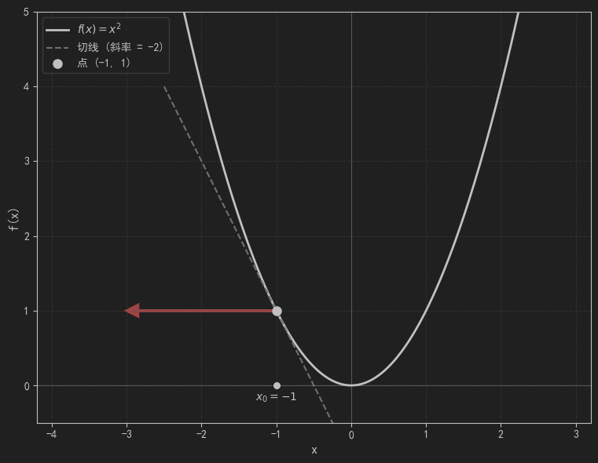

## 线性回归模型的数值解(梯度下降算法)

梯度下降算法是一种求解无约束最优化问题的一阶迭代最优化算法,它被用来求得可微函数的局部极小值。其核心思想是沿着目标函数的最速下降方向不断更新参数以逼近函数极小值。

### 梯度 (Gradient)
设

$$f:\mathbb{R}^n\rightarrow\mathbb{R}$$

是一个标量函数,并且$(f)$在点$\mathbf{x}_0=(x_1,x_2,\cdots,x_n)$处可微。

那么,$(f)$ 在 $\mathbf{x}_0$ 处的梯度定义为：

$$
\nabla f(\mathbf{x}_0)
\left(\frac{\partial f}{\partial x_1},\frac{\partial f}{\partial x_2},\cdots,\frac{\partial f}{\partial x_n}\right)_{\mathbf{x}=\mathbf{x}_0}
$$
也就是说：梯度就是函数在某一点处关于各个变量的偏导数所组成的向量。

#### 梯度的几何意义

梯度的几何意义可以用一句话来解释：梯度方向是函数增长最快的方向,梯度的模长是该点最大的变化率。与之正交的方向函数变化率为零。
结合方向导数,我们可以很轻松的使用代数来对这个结论进行求证,这里不再赘述。
> 关于方向导数和梯度,可参考[为什么梯度反方向是函数值局部下降最快的方向](https://zhuanlan.zhihu.com/p/24913912)

为了更直观的理解梯度的几何意义,来看下面两个例子:
1. 一维的例子：$f(x) = x^2$
    
    其梯度:$\nabla f(\mathbf{x}) = (2x)$,表示为从某个点$x_0$出发与坐标轴平行的射线,其方向由梯度的符号确定。如$x_0 = -1$时：
    $$\nabla f(\mathbf{x}) = (-2)$$
    大概长这样

    
2. 二维的例子:$f(x,y) = x^2 + y^2$

   其梯度:$\nabla f(\mathbf{x,y}) = (2x,2y)$,把这个碗状抛物体转化为$(xOy)$面上的等高线投影,
   然后我们分别求出点$(1,1),(1,-1),(-1,1),(-1,-1)$的梯度,就能看到

   
   
   你会发现,梯度所指的方向恰好垂直于等高线(该点处的法向量)。这就是其函数增长最快的方向

### 梯度下降算法 (Gradient Descent)

下面我们回到求解损失函数
$$
L(w,b) = \frac{1}{n}\sum_{i = 1}^{n} [y_i - f(x_i)]^2 = \frac{1}{n}\sum_{i = 1}^{n} [y_i - w_1x_{i1} - w_2x_{i2} - \cdots - w_dx_{id} - b]^2
$$
的最小值上,令 $\theta = [w_1,w_2,\cdots,w_d,b]$,则损失函数可以简写为$L(\theta)$。

对于任意的初始化参数 $\theta_t$,我们对$L(\theta)$进行一阶泰勒展开:
$$
L(\theta_t+\Delta\theta) \approx L(\theta_t)+\nabla L(\theta_t)^T\Delta\theta
$$
其中
$$
\nabla L(\theta_t) = 
\begin{bmatrix}
\frac{\partial L}{\partial w_1}\\
\frac{\partial L}{\partial w_2}
\\
\vdots
\\
\frac{\partial L}{\partial w_d}
\\
\frac{\partial L}{\partial b}
\end{bmatrix}_{\theta=\theta_t}
$$
如果我们把$L(\theta_t+\Delta\theta)$看作每次更新参数之后的函数值,而把$\nabla L(\theta_t)^T\Delta\theta$当作每次迭代的变化量,那么根据上面的关系式,只要我们能够保证
$$
\nabla L(\theta_t)^T\Delta\theta \lt 0
$$
那么就能保证每次迭代函数值都会逐步往最小值方向收敛,基于这样的想法我们不妨令$\Delta \theta = - \alpha \cdot \nabla L(\theta_t)$,那么原关系式就转化为
$$
L(\theta_t - \alpha \cdot \nabla L(\theta_t) ) \le L(\theta_t) - \alpha ||\nabla L(\theta_t)||^2
$$
这里, $\theta_t - \alpha \cdot \nabla L(\theta_t)$在点$(\theta_t)$处,我们沿着负梯度的方向走了 $\alpha ||\nabla L(\theta_t)||^2$。这便是这个更新公式的几何意义。
我们对迭代公式进行简化就得到最终的结果
$$
\theta_{t + 1} = \theta_t - \alpha \cdot \nabla L(\theta_t)
$$
其中,$\alpha$被叫做学习率,在实际应用中,它是一个可控变量,用来决定每次迭代所走的距离。
> 值得注意的是,如果我们对原函数进行二阶展开,就可以分别得到牛顿法