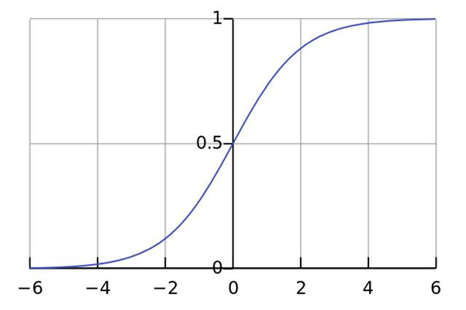

## 1. 广义线性模型

设$g(·)$为单调可微函数,若模型满足
$$
y = g^{-1}(w^Tx + b)
$$
则称上述模型为“广义线性模型”(generalized linear model).其中$g(·)$被称为“联系函数”(link function)
> 如$g(·) = ln(·)$时,模型便是对数线性回归,$g(·) = sigmoid(·)$时,模型便是对数几率回归

## 2.Sigmoid函数

**定义** sigmoid函数,也被称为对数几率函数。其函数表达式如下
$$
g(z) = \frac{1}{1 + e^{-z}}
$$

#### sigmoid函数的性质

- $\displaystyle \lim_{z \to +\infty} g(z) = 1$, $\displaystyle \lim_{z \to -\infty} g(z) = 0$
  > sigmoid 函数常用于把定义在实数范围内的变量映射到(0,1)区间,即$(-\infty,+\infty) \to (0,1)$
- $g'(z) = g(z)[1 - g(z)] > 0$
- $g''(z) = g'(z)[1 - 2g(z)]$,  $g''(0) = 0$
- $g^{-}(z) = ln(\frac{z}{1- z}) = ln(z) - ln(1 - z)$

## 3. 逻辑回归
逻辑回归（Logistic Regression）是机器学习中的一种分类模型,常用于解决二分类问题。
其回归函数满足
$$
E[y | x] =  \mu(x) = sigmoid(w^T x + b)
$$
在二分类问题当中,我们对$y$做出如下假定
$$
y \sim B(1,p(x))
$$
其中,$p(x)$表示在给定$x$的条件下$y$为正例的概率,即$p(x) = p(y = 1 |x)$.于是其条件期望
$$
E[y | x] = p(y = 1 |x) = sigmoid(w^T x + b) \tag{3.1}
$$
### 3.1 逻辑回归中参数的估计(极大似然估计)

对给定数据集$\{x_i, y_i\}_{i = 1}^{m}$, $y \sim B(1,p(x))\quad ,y_i \in \{0,1\}$,现在我们使用极大似然估计来对参数进行估计。
为了便于讨论,我们令$\theta  = (w;b)$, $x^* = (x;1)$,则在参数$\theta$下$y$的概率分布为
$$
\begin{align}
&p_1(x^*;\theta)  \stackrel{\text{def}}{=} p(y = 1 | x^*;\theta) = \frac{e^{\theta^T \cdot x^*}}{1 + e^{\theta^T \cdot x^*}} \tag{3.2}
\\
&p_0(x^*;\theta) \stackrel{\text{def}}{=} p(y = 0 | x^*;\theta) = \frac{1}{1 + e^{\theta^T \cdot x^*}} \tag{3.3}
\end{align}
$$
于是,其概率质量函数可以写成
$$
p(y | x^*; \theta) = [p_1(x^*;\theta)]^y[p_0(x^*;\theta)]^{1-y} = y \cdot p_1(x^*;\theta) + (1 - y)\cdot p_0(x^*;\theta)
$$
> 注意这里$\theta$不是条件,只有$x^*$才是条件.$p_1(x^*;\theta)$只是表示这个函数里面有参数$x^*, \theta$
> 
> 关于极大似然估计,见[参数的点估计方法](https://blog.csdn.net/weixin_44579176/article/details/163477243?spm=1001.2014.3001.5501)

那么,对上述观测$\{x^*_i, y_i\}_{i = 1}^{m}$,其对数似然函数
$$
ln[L(\theta)] = \sum_{i=1}^m ln [p(y_i | x^*_i ;\theta)]  = \sum_{i = 1}^{m} ln[y_i \cdot p_1(x^*;\theta) + (1 - y_i)\cdot p_0(x^*;\theta)]
$$
将(3.2)和(3.3)代入对数似然函数得到
$$
\begin{align}
ln[L(\theta)] &= \sum_{i = 1}^{m} ln[y_i \cdot \frac{e^{\theta^T \cdot x^*}}{1 + e^{\theta^T \cdot x^*}} + (1 - y_i) \cdot \frac{1}{1 + e^{\theta^T \cdot x^*}}]
\\
&= \sum_{i = 1}^{m} ln(\frac{y_i e^{\theta^T \cdot x^*} + 1 - y_i}{1 + e^{\theta^T \cdot x^*}})
\\
&= \sum_{i = 1}^{m} ln(y_i e^{\theta^T \cdot x^*} + 1 - y_i) - ln(1 + e^{\theta^T \cdot x^*})
\\
&= \sum_{i = 1}^{m} ln(y_i e^{\theta^T \cdot x^*} + 1 - y_i) - ln(1 + e^{\theta^T \cdot x^*})
\end{align}
$$
由于$y_i \in \{ 0,1\}$,于是
$$ ln[L(\theta)]=
\begin{cases} 
\displaystyle \sum_{i=1}^m (-\ln(1 + e^{\theta^T x^*_i})), & y_i = 0 
\\
\displaystyle \sum_{i=1}^m (\theta^T x^*_i - \ln(1 + e^{\theta^T x^*_i})), & y_i = 1
\end{cases}
$$
> 当$y_i = 0$时,$ln(y_i e^{\theta^T \cdot x^*} + 1 - y_i) = 0$
> 
> 当$y_i = 1$时,$ln(y_i e^{\theta^T \cdot x^*} + 1 - y_i) = \theta^T x^*_i$

两式综合可得

$$ln[L(\theta)] = \sum_{i=1}^m \left( y_i \theta^T x^*_i - \ln(1 + e^{\theta^T x^*_i}) \right) \tag{3.4}$$

为了使用梯度下降算法来求解似然函数的极大值,我们通常会在似然函数前加上负号,并对似然函数取平均来作为逻辑回归的损失函数。即
$$
J(\theta) = - \frac{1}{m}ln[L(\theta)] = - \frac{1}{m} \sum_{i=1}^m \left( y_i \theta^T x^*_i - \ln(1 + e^{\theta^T x^*_i}) \right)
$$
> 其单个样本的损失为: $-y\ln[p(y|x)]-(1-y)ln[1-p(y|x)]$

---
参考
- [Andrew Ng, CS 229 lecture notes](https://cs229.stanford.edu/notes2021fall/cs229-notes1.pdf)
- [Logistic Regression 模型简介](https://tech.meituan.com/2015/05/08/intro-to-logistic-regression.html)
- [Logistic_regression](http://en.wikipedia.org/wiki/Logistic_regression)
- [Logistic回归与最大熵](https://sm1les.com/2019/01/17/logistic-regression-and-maximum-entropy/#ref8)