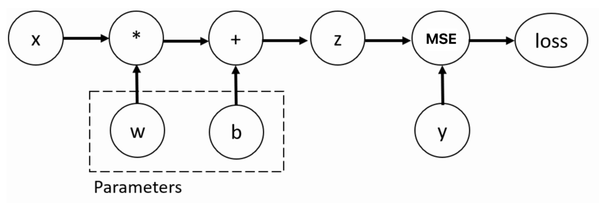

## 8.自动微分模块
训练神经网络时，最常用的算法就是反向传播。在该算法中，参数(模型权重)会根据损失函数关于对应参数的梯度进行调整。为了计算这些梯度，PyTorch内置了名为 torch.autograd 的微分引擎(自动微分模块)。
一般来说,pytorch中模型的计算流程为

```properties
前向计算 → 构建计算图 → 计算损失 → 反向传播 → 自动微分 → 优化器更新参数

自动微分：负责“怎么算梯度”
反向传播：是计算梯度的一种高效算法，利用链式法则从后往前算
优化器：拿到梯度后，负责“怎么更新参数”
```

### 8.1 前向传播与计算图的构建
前向传播：把输入数据$x$，沿着神经网络层层递进,经过所有参数和激活函数的运算,最终得到输出结果的过程。

计算图是一个有向无环图(DAG),由两部分组成：
- 节点(Nodes)：张量(数据),参数(w和b)或操作(如加、减、乘、卷积、激活函数)。
> `pytorch`中,直接创建的张量被称为叶子节点(Leaf Tensor)
- 边(Edges)：代表数据的流向(即张量作为输入,经过运算,产生输出)。

每执行一次前向传播,就是遍历一次模型代码,同时`pytorch.autograd`会遍历其中的所有数学运算,构建出计算图,在调用`backward()`时提供精确的“导数路线”。
> ###### `requires_grad`和梯度累计
> 
> 你可以在张量初始化时指定`requires_grad=True`或调用`.retain_grad()`来声明此张量数据是可训练的参数,对每个 `requires_grad=True`的叶子节点(Leaf Tensor),都会关联一个`AccumulateGrad` 节点。
> 同时,对`requires_grad=True`具有传播性，与其有关的张量都具备 `requires_grad=True`。
> 
>  每个 `requires_grad=True`的叶子节点(Leaf Tensor)其梯度都会被保存在内存中。
> 
> `AccumulateGrad`结点是`pytorch`中自动微分引擎中一个特殊的、底层的 Function节点，它专门负责接收反向传播来的梯度，并将其**累加到对应叶子张量的`.grad`属性中**,直到调用`zero_grad()`才会将梯度清零。


下图展示了一个简单的计算图,其数学表达式如下
$$
loss = MSE(y,z) \quad ,z = w * x + b
$$



在这个例子中,$w$和$b$的梯度计算方式为
$$
\begin{align}
&\frac{\partial l}{\partial w} = \frac{\partial l}{\partial z} \cdot \frac{\partial z}{\partial w} = 2(w * x + b - y) * x 
\\
\\
&\frac{\partial l}{\partial b} = \frac{\partial l}{\partial z} \cdot \frac{\partial z}{\partial b} = 2(w * x + b - y) * 1
\end{align}
$$
其中, $\frac{\partial l}{\partial z} = 2(z - y)$,被称为顶层误差信号。并在后续计算当中被传递到$\frac{\partial l}{\partial w}$和$\frac{\partial l}{\partial b}$之中。

如定义初始常量 $x=5,y=0,w=1,b=3$,可以得到其计算图的自顶向下的拓扑结构
```text
loss (grad_fn=<MseLossBackward0>) ← 均方误差结点 (关联了z和y以及MSE的求导规则)
  └── z (grad_fn=<AddBackward0>) ← 加法节点 (关联了b和w*x以及加法求导规则)
        ├── (左) MulBackward0    ← 乘法节点 (关联了w和x以及乘法求导规则)
        │     ├── w (叶子, AccumulateGrad) 
        │     └── x (常量, 不追踪)
        └── (右) b (叶子, AccumulateGrad)
```
其程序及pytorch的计算过程如下
```python
# 当X为标量时梯度的计算
def scaler_grad_compute():
    x = torch.tensor(5)
    # 目标值: label
    y = torch.tensor(0.)

    # 设置要更新的权重和偏置的初始值
    w = torch.tensor(1, requires_grad=True, dtype=torch.float32)
    b = torch.tensor(3, requires_grad=True, dtype=torch.float32)

    # 设置网络的输出值
    z = w * x + b

    # 设置损失函数,并进行损失的计算
    loss = torch.nn.MSELoss()
    loss = loss(z, y)

    # 自动微分
    loss.backward()
    # 打印 w,b 变量的梯度
    # backward 函数计算的梯度值会存储在张量的 grad 变量中
    
    print(f'w->{w.grad}')
    print(f'b->{b.grad}')

scaler_grad_compute()
```
1. 计算顶层误差:$\frac{\partial l}{\partial z} = 2(z - y) = 2 * (wx + b - y) = 16$,并传递到`AddBackward0`(加法)节点中,此时`loss`、`y`、`MSE`被“移出”计算图。
2. `AddBackward0` 把误差信号复制成两份（因为加法节点的梯度分流）：
   - (左) 乘法结点根据乘法求导法则计算出$w$的梯度：$\frac{\partial l}{\partial w} = \frac{\partial l}{\partial z} \cdot \frac{\partial z}{\partial w} = 16 * 5  = 80$,并传递给其叶子节点
   - (右) 计算$b$的梯度：$\frac{\partial l}{\partial b} = \frac{\partial l}{\partial z} \cdot \frac{\partial z}{\partial b} = 16 * 1 = 16$,由于其`requires_grad=True`且为叶子节点(Leaf Tensor),其梯度都会被保存在内存中 => `b.grad=16`。
3. 此时`+`、`*`、`x`(`requires_grad=False`)被“移出”计算图,而`w`节点接收上层的梯度并保存  => `w.grad= 80`。
> 这种通过计算图拓扑的方法简化了计算梯度的复杂度。这就是`反向传播算法(Back Propagation)`的核心思想。