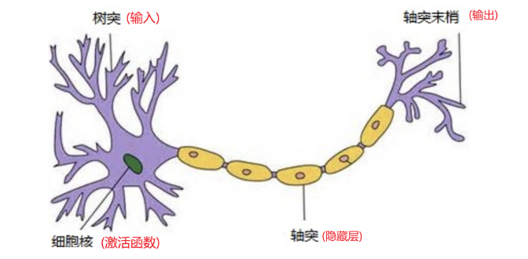
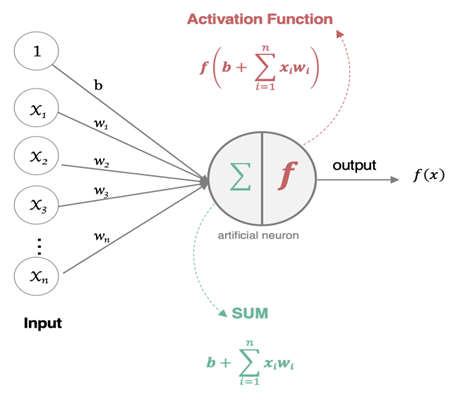
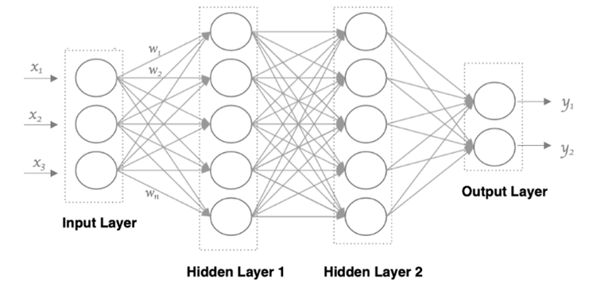

# 神经网络
人工神经网络( Artificial Neural Network, 简写为**ANN**)也简称为神经网络(NN),是一种模仿生物神经网络结构和功能的**计算模型**。

> 1. 是一种计算模型
> 2. 简称:NN

## 1. 神经元与神经网络

###  1.1 神经元

生物神经元:当电信号通过树突进入到细胞核时,会逐渐聚集电荷。达到一定的电位后,细胞就会被激活,通过轴突发出电信号。

**M-P神经元**:M-P神经元模型将生物神经元抽象为一个具备“输入-处理-输出”功能的计算单元,其工作流程可以概括为以下三步：

1. 接收输入信号：模型接收来自其他$n$个神经元的输入信号$x_i$。这些信号有强弱之分,通过连接权重$w_i$来体现。
2. 加权求和与比较：神经元将所有输入信号进行加权求和,得到一个总输入值。然后,将这个总输入值与神经元自身的阈值$θ$进行比较。
3. 激活与输出：比较的结果通过一个激活函数$f$进行处理,最终产生神经元的输出$y$。

### 1.2 神经网络 (NN)

神经网络中信息只向一个方向移动,即从输入节点向前移动,通过隐藏节点,再向输出节点移动。其中的基本部分是:

1.**输入层**: 即输入 x 的那一层

2.**输出层**: 即输出 y 的那一层

3.**隐藏层**: 输入层和输出层之间都是隐藏层[作用:加权求和+激活]

#### 特点

•同一层的神经元之间没有连接。

•第 N 层的每个神经元和第 N-1层 的所有神经元相连(这就是**full connected**的含义),这就是全连接神经网络。

•第N-1层神经元的输出就是第N层神经元的输入。

•每个连接都有一个权重值(w系数和b系数)。

# 2. 神经网络的要素
1. 网络架构 :神经网络的“骨架”,决定了信息如何流动。基本要素如下
   - **层(Layers)**：神经元按层次组织。通常分为**输入层**(接收原始数据)、**隐藏层**(进行特征提取和计算)和**输出层**(给出最终预测结果)。
   - **连接方式**：层与层之间的连接模式。例如,全连接、卷积连接或循环连接。
   - **深度**：隐藏层的数量。层数越多,网络越“深”,理论上能表达越复杂的功能。
2. 神经元与参数
   - **权重(Weights)**：连接各神经元的强度系数$w_i$,权重的大小决定了前一个神经元对后一个神经元的影响程度。
   - **偏置(Bias)**：对应M-P模型中的阈值$\theta$(通常写作 $b$,且 $b = -\theta $)。它允许神经元即使在所有输入都为0时也能被激活,增加了模型的灵活性。
   - **参数的初始化(Parameter Initialization)**: 决定神经网络的收敛速度
3. 激活函数 (非线性变换): **激活函数**用于对 **每层** 的**输出数据进行变换**, 进而为整个网络注入了**非线性因素**。
    >  如果没有激活函数,无论网络多深,最终都只是线性变换的叠加,无法解决“异或”等非线性问题。
4. 损失函数(代价函数): 衡量网络“预测值”与“真实答案”之间差距的标尺,也是网络优化的**目标**。
5. 反向传播: 基于网络结构计算各参数梯度的优化算法,能够减少大量重复计算
6. 梯度下降与优化算法
   - 要素: $w  \leftarrow w - \alpha \cdot grad(w)$
   - 梯度下降：求解最优化网络参数的算法,但传统的梯度下降容易碰到“鞍点”,“局部最优解”,“梯度消失/爆炸”等问题。
   - 优化算法：通过调整梯度下降中的学习率,加速网络收敛,优化传统梯度下降中遇到的“鞍点”,“局部最优解”,“梯度消失/爆炸”等问题。
