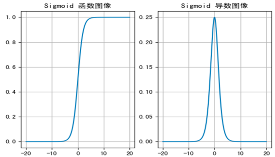
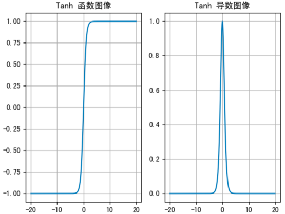
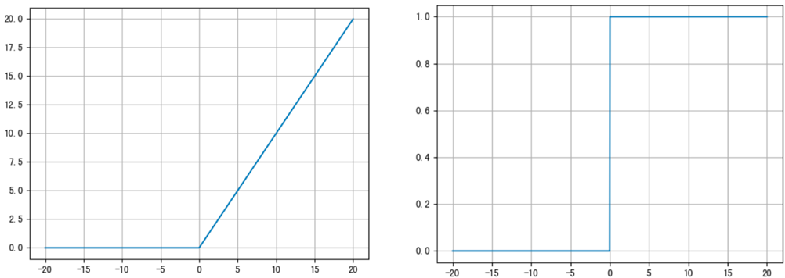
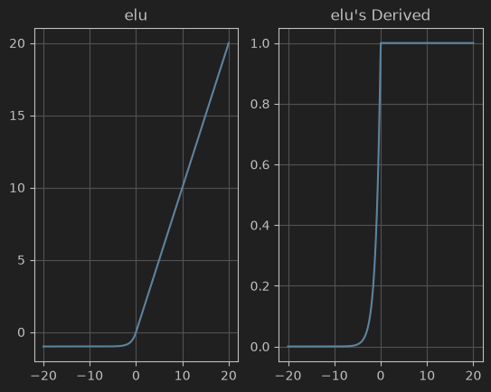
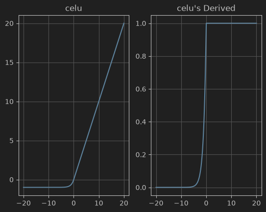
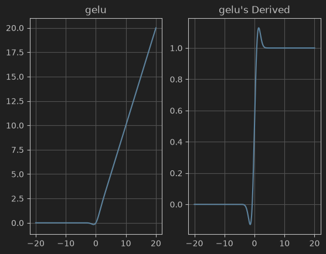
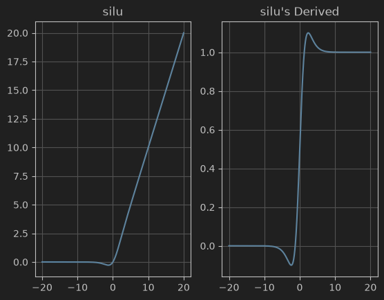
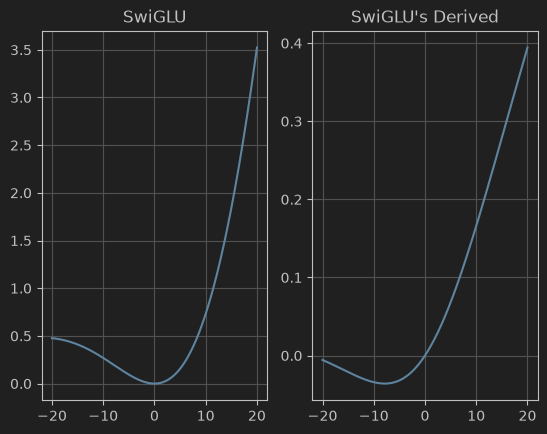

# 激活函数

**激活函数**用于对 **每层** 的**输出数据进行变换**, 进而为整个网络注入了**非线性因素**。此时, 神经网络就可以拟合各种曲线。

## 常用的激活函数

### 1. sigmoid
- 常用于解决二分类问题,其函数及导函数表达式如下

$$
\begin{align}
&f(x) = \frac{1} {1 + e^{-x}}
\\
&f'(x) = f(x)(1 - f(x))
\end{align}
$$

- 图像



```markdown
f(x):
    定义域: (-∞,+∞)
    值域:(0,1)
有效区间:[-6,6]
f'(x):
	值域: (0,0.25]
不足:计算量大
```

>一般来说， sigmoid 网络在5 层之内就会产生梯度消失现象。而且，该激活函数并不是以 0 为中心的，所以在实践中这种激活函数使用的很少

### 2. tanh

- 类似于sigmoid,可以把输入映射到(-1,1)区间。其函数及导函数表达式如下


$$
\begin{align}
&f(x) =\frac{e^x - e^{-x}}{e^x + e^{-x}}=\frac{1 - e^{-2x}}{1 + e^{-2x}}
\\
&f'(x) = 1 - f^2(x)
\end{align}
$$

- 图像



```markdown
f(x):
  值域:(-1,1)
  有效区间:[-3,3]
特点:
  - 收敛速度比sigmoid快
  - 存在梯度消失问题
```


### 3. Dynamic Tanh

- 基于层归一化思想对tanh的改进,在其中引入了可学习的参数($\gamma,\alpha,\beta$),其表达式如下

$$
\begin{align}
&DyT(x) = \gamma \cdot tanh(α * x) + β
\\
&DyT'(x) = \gamma \cdot \alpha \cdot (1 - y^2_{tanh})
\end{align}
$$

```markdown
f(x):
  值域:(-γ,γ)
  有效区间:[-3/α,3/α]
特点:
  - 对有效区间进行动态拉伸,α越大有效区间越窄 
  - 收敛速度由α决定,一般来说 α * γ  > 1时,梯度更大,其收敛速度越快。常把α初始化为0.5,但在LLM中,为了训练稳定性,α一般设置为较小值
  - 相对延缓了梯度消失的问题
```

### 4. softmax

`softmax`常用于多分类过程中，它是二分类函数sigmoid在多分类上的推广，目的是将多分类的结果以概率的形式展现出来。计算方法如下所示

对给定向量$z = (z_1,z_2,\cdots, z_n)$
$$
softmax(z_i) = \frac{e ^ {z_i}}{\sum_{j = 1}^{n} e^{z_j}}
$$

```markdown
f(x):
  值域:(0,1)
特点:
 - softmax函数把n维向量转换为n个可能结果的概率分布。例如在softmax回归中,其概率建模为 P(y = j|X = x) = softmax(w^T x)
 - 对 softmax的结果求期望值,即可得到Softargmax函数。表示为 Softargmax(z) = Σ z_i * softmax(z_i),其期望值是argmax的平滑近似。
```


### 5.ReLu
整流线性单位函数（Rectified Linear Unit, ReLU）,又称修正线性单元。旨在通过数学函数形式模拟生物神经单元,其函数形式如下:

$$
\begin{align}
&f(x) = max(0,x)
\\
&f'(x) = \begin{cases}0 & {,x < 0}\\1 & ,x \geq 0 \end{cases}
\end{align}
$$

```markdown
优点:
    - 计算量小,是最常用的一种激活函数
    - Relu会使一部分神经元的输出为0，这样就造成了网络的稀疏性，并且减少了参数的相互依存关系，缓解了过拟合问题的发生。
缺点:
    - 存在 '神经元死亡' 问题
```

> 随着训练的推进，部分输入会落入小于0区域，导致对应权重无法更新。这种现象被称为 神经元死亡。

- 图像


### 6. Leaky ReLu
ReLU函数的变种,旨在解决神经元死亡问题。其表达式如下

$$
\begin{align}
&f(x) = max(\lambda x,x) \quad , \lambda \lt 1
\\
&f'(x) = \begin{cases}\lambda & {,x < 0}\\1 & ,x \geq 0 \end{cases}
\end{align}
$$

```markdown
优点:
    - 可以解决神经元死亡的问题,“即使输入参数为负数,也可以进行缓慢的更新”
    - 计算相对高效,并且可以保证一定的网络稀疏性
缺点:
    - 存在负偏移问题。比如对[-2,2]的均匀分布的输入，在经过多层Leaky ReLu之后负数会被压缩到近似于0的极小值中,而正输入保持不变,严重破坏了原始数据分布规律。而传统ReLu则具备天然的正则化作用
    - 由于其左右导数差异较大,Leaky ReLu在深层网络中容易产生锯齿震荡难以收敛的问题。
应用:
    - 一般会配合BatchNorm解决负偏移问题
    - 如果把λ作为可学习的参数,在数据量较大时,效果会更好。参考PReLU
    - Leaky ReLu常被应用于GANs网络和目标检测中
```

### 7. ELU
ELU(Exponential Linear Unit)是对ReLu的改进,是对 ReLu（Rectified Linear Unit）的一种改进，旨在克服 ReLU 神经元死亡的问题.具体而言是通过定义了一个指数负区间来代替0值.
$$
f(x)=
\begin{cases}
x & {,x>0}
\\ 
α(e^x−1) & {,x≤0}
\end{cases}
$$

- 图像



```markdown
优点:
    - 可以解决神经元死亡的问题,“即使输入参数为负数,也可以进行缓慢的更新”
    - 对极端负噪声具备抑制能力
    - 导数更平滑,可以一定程度解决Leaky ReLu中存在的震荡问题
缺点:
    - 指数运算导致其计算成本高
```
### 8. Celu
**CELU**（Continuously Differentiable Exponential Linear Unit）是 ELU（Exponential Linear Unit）的一个扩展，它通过对负值区域引入一个平滑的连续函数，进一步改善了神经元死亡问题，并增强了激活函数的灵活性。CELU 激活函数的设计目的是避免 ReLu 的死区问题，同时具备与 ELU 类似的平滑行为，但是具有一个可调的平滑程度。

$$
f(x) =
\begin{cases}
x, & \text{if } x > 0 \\
\alpha (e^{\frac{x}{\alpha}} - 1), & \text{if } x \leq 0
\end{cases}
$$

- 图像



```markdown
优点:
    - 可以解决神经元死亡的问题,“即使输入参数为负数,也可以进行缓慢的更新”
    - 对极端负噪声具备抑制能力
    - 0点处导数连续,且其导函数是(0,1)区间的有界函数
缺点:
    - 指数运算导致其计算成本高
```
### 9. GELU

Gelu(Gaussian Error Linear Units)同样是对ELU的一种改进方案,是当前最主流的激活函数之一,被Transformer系模型广泛应用。
Gelu借助Dropout的按概率激活的思想对Relu激活进行了改进: 其核心思想是利用标准正态分布对原始输入进行不同程度的放缩,其表达式如下
$$
\begin{align}
&GELU(x) = x \cdot \Phi(x) ≈ 0.5x\cdot[1 + tanh(\sqrt{\frac{2}{\pi}(x + 0.044715 \cdot x^3) })]
\\
&GELU'(x) = \Phi(x) + x \cdot \phi(x)
\end{align}
$$

- 图像

```markdown
表达式后面是如今pytorch对GELU的计算近似

优点:
    - 具备ELU的所有优点,并且其各阶导数连续。
    - 通过近似函数使得GELU的计算效率远高于ELU
缺点:
    - 显存占用高
    - 函数在负数区域非单调,会为损失函数引入额外的局部极小值
    - 对权重初始化敏感
```

###  10. Swish / SiLU
Swish(Searching for Activation Functions)使用sigmoid映射代替GELU的高斯映射,进一步提升了计算效率。并且其梯度数值更稳定,不会出现数值溢出的情况。

- 图像


> [原文链接](https://arxiv.org/abs/1710.05941)

### 11. SwiGLU
通过门控逻辑单元对SiLU的一种改进方案,核心思想是把输入分别传递到门控旁路中并与其真值逐元素累乘,其表达式如下
$$
\begin{align}
&SwiGLU(x) = x  \otimes Swish(x)  \quad , \otimes \text{表示hadamard积}
\\ 
& Swish(x) = x \cdot sigmoid(\beta x) \quad , \beta = 1  \text{时Swish(x) = SiLU(x)}
\end{align}
$$

- 实现
```python
import torch
import torch.nn.functional as F
import torch.nn as nn
class SwiGLU(nn.Module):
    r"""
    $$
    \text{SwiGLU}(x) = W_{out} \cdot \left( \text{Swish}(W_g x) \odot W_v x \right)
    $$
    """
    def __init__(self, dim, hidden_dim):
        super().__init__()
        # 将 gate 和 value 的权重拼成一个大的线性层
        # 输出维度是 2 * hidden_dim
        self.gate_value_proj = nn.Linear(dim, 2 * hidden_dim, bias=False)

        self.out_proj = nn.Linear(hidden_dim, dim, bias=False)

        ## 参数初始化
        nn.init.constant_(self.gate_value_proj.weight,0.1)
        nn.init.constant_(self.out_proj.weight,1)

    def forward(self, x):
        # 一次矩阵乘法得到 gate 和 value 的拼接
        gate_value = self.gate_value_proj(x)
        # 在最后一个维度上拆分成两半
        gate, value = gate_value.chunk(2, dim=-1)
        # 应用门控
        return self.out_proj(F.silu(gate) * value)
```
- 图像(初始化参数为[0.1,1])


> [原文链接](https://arxiv.org/abs/2002.05202)
