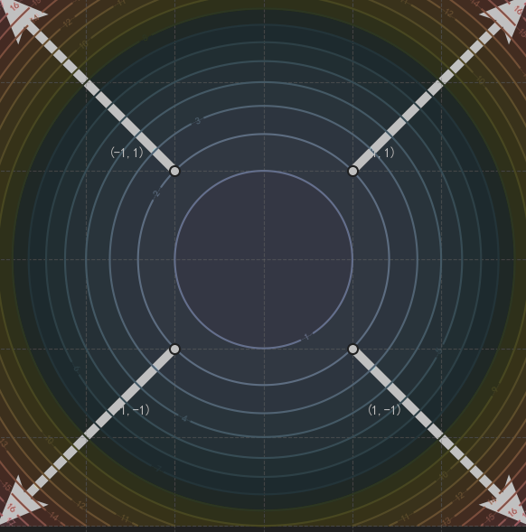

# 梯度下降算法

梯度下降算法是一种求解无约束最优化问题的一阶迭代最优化算法,它被用来求得可微函数的局部极小值。其核心思想是沿着目标函数的最速下降方向不断更新参数以逼近函数极小值。

## 1. 梯度 (Gradient)
设

$$f:\mathbb{R}^n\rightarrow\mathbb{R}$$

是一个标量函数,并且$(f)$在点$\mathbf{x}_0=(x_1,x_2,\cdots,x_n)$处可微。

那么,$(f)$ 在 $\mathbf{x}_0$ 处的梯度定义为：

$$
\nabla f(\mathbf{x}_0)
\left(\frac{\partial f}{\partial x_1},\frac{\partial f}{\partial x_2},\cdots,\frac{\partial f}{\partial x_n}\right)_{\mathbf{x}=\mathbf{x}_0}
$$
也就是说：**梯度就是函数在某一点处关于各个变量的偏导数所组成的向量**。

#### 梯度的几何意义

- 梯度方向是函数增长最快的方向
- 梯度的模长是该点最大的变化率
- 与之正交的方向函数变化率为零。

> 关于方向导数和梯度,可参考[为什么梯度反方向是函数值局部下降最快的方向](https://zhuanlan.zhihu.com/p/24913912)

以二元函数为例,设$z = f(x,y) = x^2 + y^2$。这是一个以原点为中心的碗状抛物线,其梯度为$\nabla f(\mathbf{x,y}) = (2x,2y)$,把这个碗状抛物体转化为$(xOy)$面上的等高线投影,
然后分别求出点$(1,1),(1,-1),(-1,1),(-1,-1)$的梯度,就能看到

其梯度所指的方向恰好垂直于等高线(该点处的法向量),这就是其函数增长最快的方向。

## 2. 假设函数与损失函数

### 2.1 假设函数
在监督学习中，我们假设数据存在一个潜在的映射关系 $ f: \mathcal{X} \rightarrow \mathcal{Y} $。由于我们不知道 $ f $ 的真实形式，我们**人为选定一个参数化的函数族**来近似它，这个函数族就是假设空间 $ \mathcal{H} $。

我们用参数向量 $ \theta $ 来表示这个模型，记作 $ h_\theta(x) $。
> $h_\theta(x)$是形式已知而参数未知的函数,在监督学习中,就是通过梯度下降等最优化方法求解最优的模型参数$\theta$。
如
> -   **线性回归的假设函数**：$ h_\theta(x) = \theta_0 + \theta_1 x_1 + \cdots + \theta_n x_n = \theta^T x $
> -   **逻辑回归的假设函数**：$ h_\theta(x) = \frac{1}{1 + e^{-\theta^T x}} $（在线性组合外嵌套了Sigmoid非线性映射）。

### 2.2 损失函数(代价函数)

衡量模型预测值与真实值差异的非负实值函数,记作$L(\theta)\text{或}J(\theta)$,如均方误差损失$J(\theta) = \frac{1}{2m} \sum_{i=1}^{m} \left( h_\theta(x^{(i)}) - y^{(i)} \right)^2$。

## 3. 梯度下降

梯度下降算法的一般步骤如下:
1. 对损失函数$J(\theta)$求偏导,得到其梯度$\nabla J(\theta)$
2. 初始化参数$\theta_0$,然后让参数$\theta_0$沿着梯度的反方向更新。其更新公式如下
$$
\theta' = \theta - \alpha \cdot \nabla J(\theta) \quad,(\alpha \text{为学习率,控制迭代步长})
$$
3. 重复1,2直到梯度为0或达到最大迭代轮次

由于损失函数具体的形式与使用的样本数量有关,因此,根据使用样本数量的不同,梯度下降也分为如下几种不同的迭代方式(主流的几种):

1. 全梯度下降(FGD): 在迭代过程中随机选取全部样本$\{x^{(1)},x^{(2)},\cdots ,x^{(n)}\}$来计算梯度。其特点是训练速度较慢，并且有可能陷入局部最优解。
2. 随机梯度下降(SGD): 在迭代过程中随机选取一个样本$\{x^{(i)}\},(i = 1,2,\cdots,n)$来计算梯度。其特点是计算简单，不容易陷入鞍点,但容易产生震荡。
3. 小批量梯度下降(mini-batch): 在迭代过程中随机选取小批量的样本$\{X', \quad X' \in X\}$来计算梯度。
4. 随机平均梯度下降(SAG): 在迭代过程中随机选取一个样本$\{x^{(i)}\},(i = 1,2,\cdots,n)$计算其梯度值,然后和以往样本的梯度值求均值作为更新的梯度值。

> 基于少数样本的随机梯度下降的核心思想是期望通过小规模的样本梯度来近似全体样本的梯度。

#### 3.1 学习率

学习率控制着我们每次迭代参数更新的幅度，是梯度下降中不可获取的参数。通常，学习率过小会导致学习缓慢甚至停滞。过大则会导致震荡。
另外，在现代深度学习当中，为了
- 保证基于小批量样本的随机梯度下降能够正确收敛
- 避免学习过程中陷入局部极小值点
- 加速训练

通常会根据实际情况使用不同的学习率优化策略，如基于动量的学习。

### 为什么可以用少数样本的梯度代替全量样本的梯度?

下面以SGD为例,分析其收敛的可靠性。

---

设$L(x^{(i)},\theta)$为全部样本$X = \{x^{(1)},x^{(2)},\cdots ,x^{(n)}\}$的单样本损失。
$t$为算法的迭代轮次,在第$t$步随机抽取的样本索引为$I_t$,$I_t$是定义在概率空间上的随机变量其PMF为: $P\{I_t = i \} = \frac{1}{n}$。
于是我们可以得出以下推论:

##### 1. 误差-方差分析
定义$t$时刻的梯度 $g_t = \nabla L(x^{(I_t)},\theta_t)$,则
- 单步梯度的均值:
$$
E[g_t] = E[E[g_t | \mathcal{F}_{t-1}]] = \sum_{i=1}^{n} P\{I_t = i \} \cdot \nabla L(x^{(i)},\theta_t) = \frac{1}{n} \sum_{i=1}^{n} \nabla L(x^{(i)},\theta_t) = \nabla_{full} L(\theta)
$$
其中,$\mathcal{F}_{t-1} = \sigma(I_1,I_2,\cdots,I_{t-1})$。

**结论** 单样本梯度的期望是全量样本的无偏估计,平均梯度下降的方向始终是正确的.(好比你在街上问路,问10个人,尽管每个人给你指明的方向都有出入但平均而言是一致的)

参考

- [Robbins & Monro (1951). A Stochastic Approximation Method.](https://www.columbia.edu/~ww2040/8100F16/RM51.pdf)
- [Blum (1954)](https://ar5iv.labs.arxiv.org/html/0908.3529#2)
- [DeepLearning.yoshua bengio]()
- [动手深度学习. 11.4. 随机梯度下降](https://zh.d2l.ai/chapter_optimization/sgd.html)
- [从动力学角度看优化算法（一）：从SGD到动量加速 ](https://spaces.ac.cn/archives/5655)
- [让炼丹更科学一些（一）：SGD的平均损失收敛](https://spaces.ac.cn/archives/9902)
- [自己的笔记仓库](https://github.com/DreamHowYao/MachineLeariningGuidance)