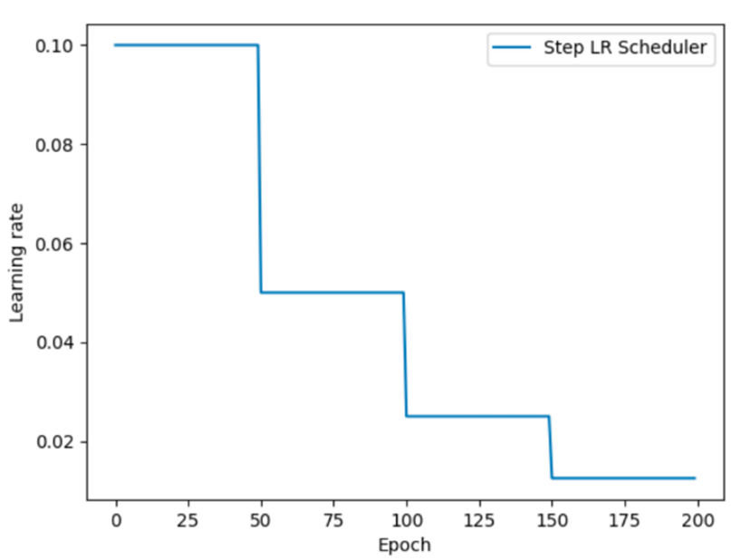
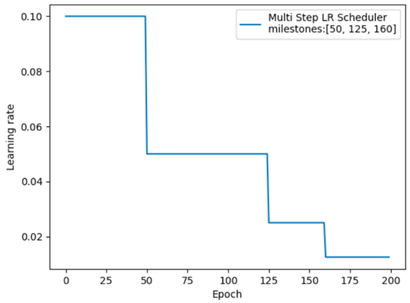
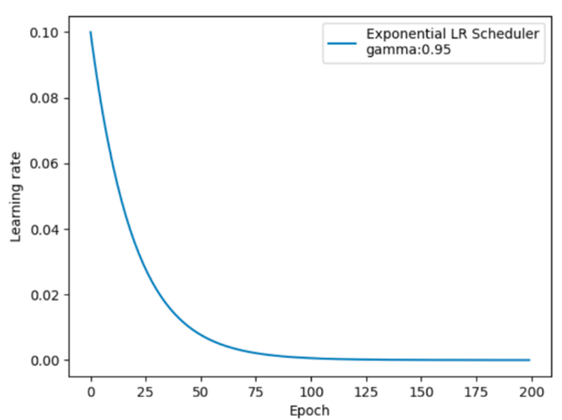
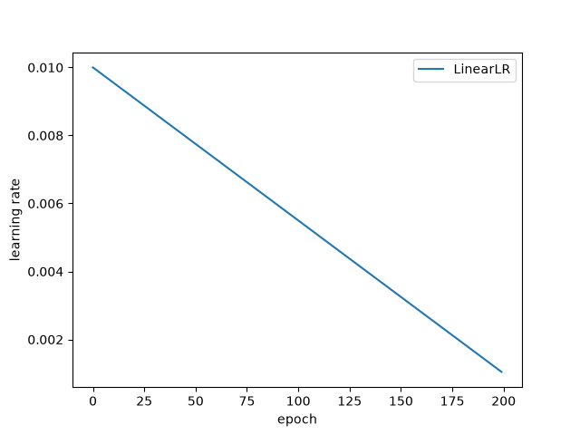
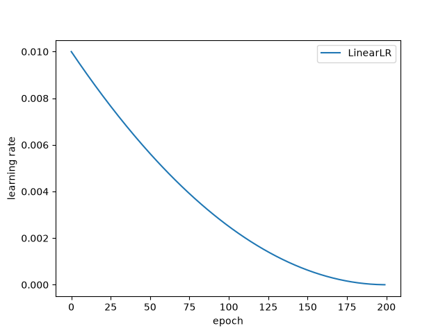
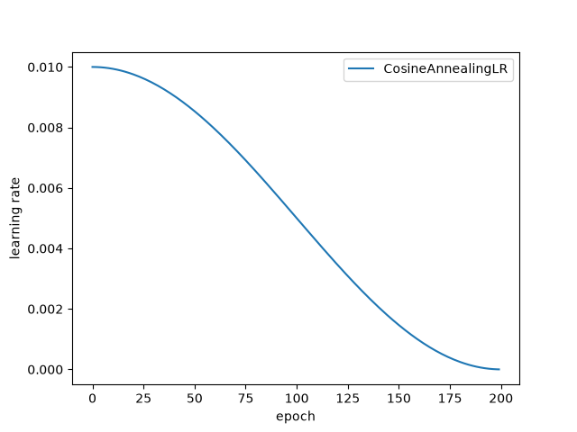

# 梯度下降的优化方法

## 1. 问题背景

梯度下降在迭代过程中存在以下问题
1. 目标函数存在平缓区域,梯度值较小,参数优化变慢
2. 目标函数存在 “鞍点” ,梯度为 0,参数无法优化
3. 目标函数存在局部最小值,梯度下降所求解的参数不是最优参数

> 此外,在SGD中,收敛的一个必要条件是Robbins-Monro 条件,因此有必要引入一个随时间变化的学习率$\eta(t)$对算法的收敛性进行有效把控,这正是3.所要做的事.

---

## 2. 基于梯度的优化

### 2.1 指数加权平均(优化思想)
给定一个序列 $ a_1, a_2, \dots, a_t $,指数加权平均定义为：

$$
v_t = \beta v_{t-1} + (1-\beta) a_t
$$

其中 $ \beta \in [0,1) $ 是衰减率（通常 0.9、0.99 等）。

展开可得：

$$
\begin{align}
v_t
&=\beta (\beta v_{t-2} + (1-\beta) a_{t-1}) + (1-\beta) a_t \\
&= \beta^2 v_{t-2} + \beta(1-\beta) a_{t-1} + (1-\beta) a_t \\
&= (1-\beta)\sum_{i=1}^{t} \beta^{t-i} a_i \\
\end{align}
$$

即**离当前越近的项权重越大,越远的项权重按指数衰减**。有效窗口大约为 $ \frac{1}{1-\beta} $ 步。
> 例如,$\beta = 0.9$时,权重衰减到$e^{-1}$(有效窗口)需要约10步。

---

### 2.2 Momentum动量法
Momentum动量法基于指数加权平均思想来优化权重,其梯度更新方式如下
$$
\begin{align}
&v_t = \beta \cdot v_{t-1} + \eta g_t = \eta \sum_{i=1}^t \beta^{t-i}g_i
\\
&\theta_{t+1} = \theta_{t} - v_t
\end{align}
$$
其中$\eta$为学习率 ,$v_t$表示$t$时刻的“动量(惯性)”,显然$v_0=0$

>- Momentum动量各权重之和为:$ \eta \sum_{i=1}^t \beta^{t-i} = \eta \frac{1 - \beta^t}{1-\beta}$。当$t \to \infty$时,级数和趋于$\frac{\eta}{1-\beta}$,这个结果表明,在一组近似的的梯度序列$\{g_i\}, i = 1, 2 ,\cdots ,t$中,学习的步长为$\frac{\eta}{1-\beta}$(一个近似的迭代步长,用作训练参考)。
>- Momentum动量 会基于多个历史梯度来估计真实的梯度方向,从统计角度来看这种估计是有偏的,但却能够有效的抑制不同样本给梯度带来的方差影响。
>- Momentum 的有效性可以参考文章[Why Momentum Really Works](https://distill.pub/2017/momentum/)或参考这个更为简单的案例[动手深度学习](https://zh.d2l.ai/chapter_optimization/momentum.html)
>- 动量法为小梯度方向提供了动力,使其能够跨越平坦区。在大梯度方向具有鲁棒性,从而抑制震荡。
>- 动量法最早由Polyak(1964)提出,并证明在确定性的条件下可以线性收敛,最早被应用在GD中。后续被推广到SGD中:“在适当的参数初始化和缓步增加的动量调度方式下,SGD+Momentum具备良好的收敛速度”
>- 在pytorch中为了统一SGD和SGD+Momentum对公式做了以下优化:
$$
\begin{aligned}
v_{t+1} & = \mu * v_{t} + g_{t+1} \\
p_{t+1} & = p_{t} - \text{lr} * v_{t+1}
\end{aligned}
$$

---

### 2.2 Nesterov动量法(NAG)
Momentum动量的改进,引入了"前瞻"机制:使用$\theta_t$的下一个动量单位的梯度$\nabla L(θ_t - \beta·v_{t-1})$来代替原梯度,其更新公式如下
$$
\begin{align}
&\Theta_t=\theta_t - \beta v_{t-1} \\
&v_t =  \beta v_{t-1} + \eta  \nabla L(\Theta_t) \\
&\theta_{t+1} = \theta_{t} - v_t
\end{align}
$$

---

### 2.3 自适应梯度算法(Adagrad)

AdaGrad 通过引入预条件矩阵 $G_t^{-1/2}$,使梯度在不同方向上具备自适应的“学习率”。其更新方式如下：

$$
\begin{align}
&G_t = G_{t-1} + g_t g_t^\top \\
&\theta_{t+1} = \theta_t - \eta \left(G_t^{1/2} + \epsilon I\right)^{-1} g_t
\end{align}
$$

其中,$g_t$ 表示第 $t$ 时刻的梯度向量,$\epsilon$ 是防止除零的小常数。在实际使用中,通常对 $G_t$ 进行**对角近似**,只保留其对角线元素（即原文的**对角版本**）

> - **与 Hessian 的关系**：形式上,AdaGrad 使用 $G_t^{-1/2}$ 作为**预条件矩阵**,起到类似牛顿法中 $H^{-1}$ 的作用。
> - **两个版本**：原文中 $G_t$ 拥有两个版本——**对角化版本**（Algorithm 1,实验使用,计算 $O(d)$）和**非对角化版本**（Algorithm 2,仅理论推导,计算 $O(d^3)$）。论文最后还提出**块对角版本**作为折中。
> - **应用**: 实际对角近似直接被简化成梯度的L2范数,然后再累加。
> - **局限性**：AdaGrad 适用于稀疏特征的短时学习。在现代深度学习中,由于 $G_t$ 单调不减,$G_t^{-1/2}$ 单调不增,学习率会过早降低,导致模型后期几乎无法学习。这是 **RMSProp** 和 **Adam** 等后续算法的动机。

---

### 2.4 RMSprop(Root Mean Square Propagation)
RMSProp是对AdaGrad的优化。最主要的不同是,其使用**指数移动加权平均梯度**替换历史梯度的平方和。其更新方式如下：
$$
\begin{align}
&v_t = \beta v_{t-1} +  (1 - \beta) {g_t}^2 \\
&\theta_{t+1} = \theta_t - \frac{\eta}{\sqrt{v_t + \epsilon}}g_t
\end{align}
$$
其中,${g_t}^2$表示梯度向量逐元素平方

---

### 2.5 Adam

**Adam（Adaptive Moment Estimation）算法** 是一种广泛使用的自适应学习率优化算法，它结合了动量（Momentum）和 RMSProp 的思想，用于加速梯度下降过程，特别适用于深度学习等大规模参数优化问题。

**核心思想**

Adam 算法通过为每个参数维护两个估计量：

- **一阶矩估计（梯度的均值）**：捕捉梯度的方向信息，相当于动量机制。
- **二阶矩估计（梯度平方的均值）**：捕捉梯度的幅度信息，用于对学习率进行自适应调整。

这两个估计量帮助算法根据历史梯度的信息自动调整每个参数的更新步长，从而既能利用梯度的方向（动量）加速收敛，又能根据梯度的大小（自适应学习率）防止参数更新过大或过小。

**算法步骤**

设定目标函数为 J(θ) 需要优化的参数为 θ，在每次迭代中计算梯度 $g_t=∇J(θ_t)$

Adam 算法的具体更新步骤如下：

#### 1. **初始化** 

设置初始参数$θ_0$，并初始化：

$$
m_0=0,v_0=0,t=0
$$

同时设定超参数：
  - 学习率 η（通常如 0.001）
  - 一阶矩衰减率 β1（常取值为 0.9）
  - 二阶矩衰减率 β2（常取值为 0.999）
  - 防止除零的小常数 ϵ（例如 10^−8）
#### 2. 梯度与矩估计更新

对于每一次迭代 t=1,2,…，进行以下更新：

- **更新一阶矩（梯度均值）的指数加权平均：**

$$
m_t = \beta_1*m_{t-1} + (1 - \beta_1)*g_t
$$

- **更新二阶矩（梯度平方均值）的指数加权平均：**
$$
v_t = \beta_2*v_{t-1} + (1 - \beta_2)*g_t^2
$$

#### 3. 偏差修正

由于 m0 和 v0 初始化为零，在初期估计会存在偏差。为了校正这一偏差，进行以下计算：
$$
\hat{m}_t = \frac{m_t}{1 - \beta_1^t}, \quad \hat{v}_t = \frac{v_t}{1 - \beta_2^t}
$$

#### 4. 参数更新

最后使用修正后的矩估计更新参数：
$$
\theta_{t+1} = \theta_t - \eta \frac{\hat{m}_t}{\sqrt{\hat{v}_t} + \epsilon}
$$

---

### 2.6 AdamW

AdamW 是 Adam 的一个修正版本，核心改动是把权重衰减（Weight Decay）从梯度更新中解耦出来。这个改动让 Adam 的泛化能力显著提升，如今已成为 Transformer 和大模型训练的标配。

**Adam存在的问题**: Adam 会用历史梯度的均方根来归一化梯度,当 L2 惩罚项的梯度被“混入”总梯度后，它也会被这个均方根同样缩放。导致:

1. 在梯度天然较大的参数上，L2 惩罚被“稀释”了，权重衰减几乎不起作用。

2. 在梯度天然较小的参数上，权重衰减又可能过强。

针对此问题,AdamW在Adam的基础上为每一个参数都单独施加了权重衰减,其更新方式如下:

$$
\theta_{t+1} = \theta_t - \eta (\frac{\hat{m}_t}{\sqrt{\hat{v}_t} + \epsilon} + \lambda\theta_{t})
$$

其中,$\lambda$是正则化系数

---

### 2.7 其他主流优化器
- Adamax
- NAdam(Nesterov-accelerated Adam)
- RAdam( Rectified Adam)
- Shampoo
- Muon
- Pion
## 3. 基于学习率的优化 (动态学习率)
从宏观角度来看模型的学习策略来看,在训练初期我们需要更大的学习率来让模型更快的冲出鞍点和平缓区,在后期我们需要更小的学习率来保证模型能收敛到最优参数。

因此大方向上学习率是一个单调减函数,此外,在现代模型学习实践中发现：**不使用预设的较大学习率,而是从一个很小的值开始,逐步增加到预设的初始学习率,然后再按正常的调度策略进行训练可以加速模型收敛**,这种优化技巧也被称为学习率预热(Learning Rate Warmup)。
> 目前学习率预热相关的理论还在跟进中,比较主流的说法是在训练初期,由于参数是随机初始化的,此时损失函数的梯度和优化器参数都不稳定
>- 下面介绍的几种衰减策略都可以变化为预热策略,一般而言都是 线性预热+其他衰减 或者是 两两对应的预热+衰减方案

总而言之,目前深度学习中有以下几种学习率调整策略:
### 3.1 等间隔衰减
- **定义**： 每隔固定的$T$个epoch,学习率乘以一个衰减因子$\gamma$。
- 公式: $\eta_t = \eta_0 \cdot \gamma^{\lfloor t/T \rfloor}$
    >  其中, $T$是衰减周期,$t$是当前epoch。$\lfloor t/T \rfloor$表示向下取整。
    
- 图像[阶梯型下降方式,(间隔一致)] 

### 3.2 指定间隔衰减
- **定义**： 在指定epoch/step下进行学习率衰减。
- 公式: $\eta_t = \eta_0 \cdot \gamma^{k(t)}$
>  其中 $k(t)$ 表示到第 $t$ 个 epoch 为止,已经经过了多少个预设的衰减点。
>
> 比如指定一个递增的`milestones:list = [10,20,30]`,那么
>- 在$epoch \lt 10$时：$\eta= \eta_0$
>- 在$10 \le epoch \lt 20$时: $\eta= \eta_0 \cdot \gamma$
>- 在$20 \le epoch \lt 30$时: $\eta= \eta_0 \cdot \gamma^2$
>- 在$epoch \ge 30$时: $\eta= \eta_0 \cdot \gamma^3$
- 图像[阶梯型下降方式,(间隔不一致)]

### 3.3 指数衰减
- **定义**： 学习率以时间$t$指数衰减
- 公式: $\eta_t = \eta_0 \cdot \gamma^t = \eta_0 \cdot e^{t\cdot ln(\gamma)}$
- 图像

### 3.4 线性衰减
- **定义**： 学习率随时间$t$匀速(线性)衰减
- 公式: $\eta_t = \eta_0 \cdot (1 - \frac{t}{T}) = \eta_0 - \eta_0 * \frac{t}{T}$
- 图像

### 3.5 多项式衰减
- **定义**： 学习率随时间$t$以多项式函数方式衰减
- 公式: $\eta_t = \eta_0 \cdot (1 - \frac{min(t,T)}{T})^p $
- 图像[p=2]

### 3.6 余弦退火(CosineAnnealing)
- **定义**： 用余弦曲线的一半$[0,\pi]$区间来控制学习率,让它从 $\eta_0$ 平滑降到 $\eta_{\min}$,特点是衰减速度“先慢、中快、后慢”。
- 公式: $\eta_t = \eta_{\min} + \frac{1}{2}(\eta_0 - \eta_{\min})\left(1 + \cos\frac{t}{T}\pi\right)$
- 图像

### 3.7 周期变化的学习率调整策略

让学习率周期性变化,而非单纯的单调递减的学习率调整策略。其主要思想是通过间隔时间的提高学习率,帮助模型更快的跳过鞍点和局部极小值,从而找到更优解。
> 最终还是会递减到一个较小值

常见的几种调整方式如下

- 余弦热重启(CosineAnnealingWarmRestarts): 余弦退火 + 周期性重启,每个周期结束把学习率重置回较大值
- 单周期(OneCycleLR): 一个周期内先升后降,通常配合 momentum 使用
- 三角学习率(CyclicLR): 三角形或三角形周期变化,学习率在上下界之间循环

---

###### 参考
- [Polyak, B. T. (1964)](https://papers.baulab.info/papers/also/Polyak-1964.pdf)
- [Handbook of Convergence Theorems for (Stochastic) Gradient Methods](https://export.arxiv.org/pdf/2301.11235#22#1)
- [On the importance of initialization and momentum in deep learning](http://www.cs.toronto.edu/%7Ehinton/absps/momentum.pdf)
- [Why Momentum Really Works](https://distill.pub/2017/momentum/)
- [从动力学角度看优化算法（一）：从SGD到动量加速](https://spaces.ac.cn/archives/5655)
- [Adaptive Subgradient Methods for Online Learning and Stochastic Optimization](https://jmlr.org/papers/v12/duchi11a.html)
- [Hinton lecture](https://www.cs.toronto.edu/~tijmen/csc321/slides/lecture_slides_lec6.pdf)
- [ADAM: A METHOD FOR STOCHASTIC OPTIMIZATION](https://arxiv.org/pdf/1412.6980)
- [Decoupled Weight Decay Regularization](https://ar5iv.labs.arxiv.org/html/1711.05101#1)
